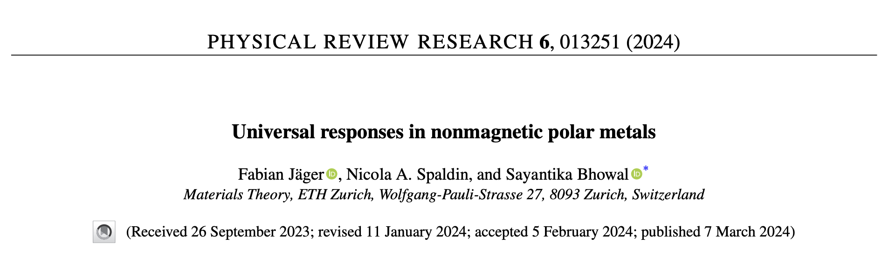

# Kinetic magnetoelectric effect in non-magnetic polar metals

This repo contains the kinetic magnetocelectric effect calculations for doped PbTiO3,  done for the APS publication [Universal Responses in non-magnetic polar metals](https://journals.aps.org/prresearch/abstract/10.1103/PhysRevResearch.6.013251)

